# ProbablyBackpacks Expansion

[English](README.md) | **Español**

Un paquete de configuración para **ProbablyBackpacks** que extiende la progresión de mochilas por defecto a **21 niveles de mochila + Mochila Legendaria**, con recetas de crafteo balanceadas y una interfaz **DeluxeMenus** totalmente integrada.

> **Nota**
> Este repositorio **no** es un plugin ni un fork de ProbablyBackpacks. Es un paquete de configuración hecho por la comunidad que extiende el plugin original.

---

## Interfaz de DeluxeMenus
Craftea mochilas y mejoras directamente desde la GUI.

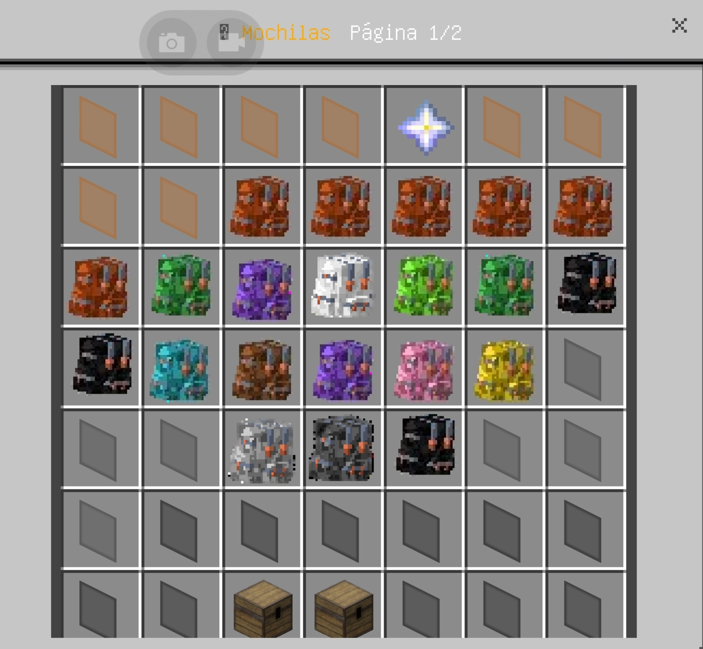
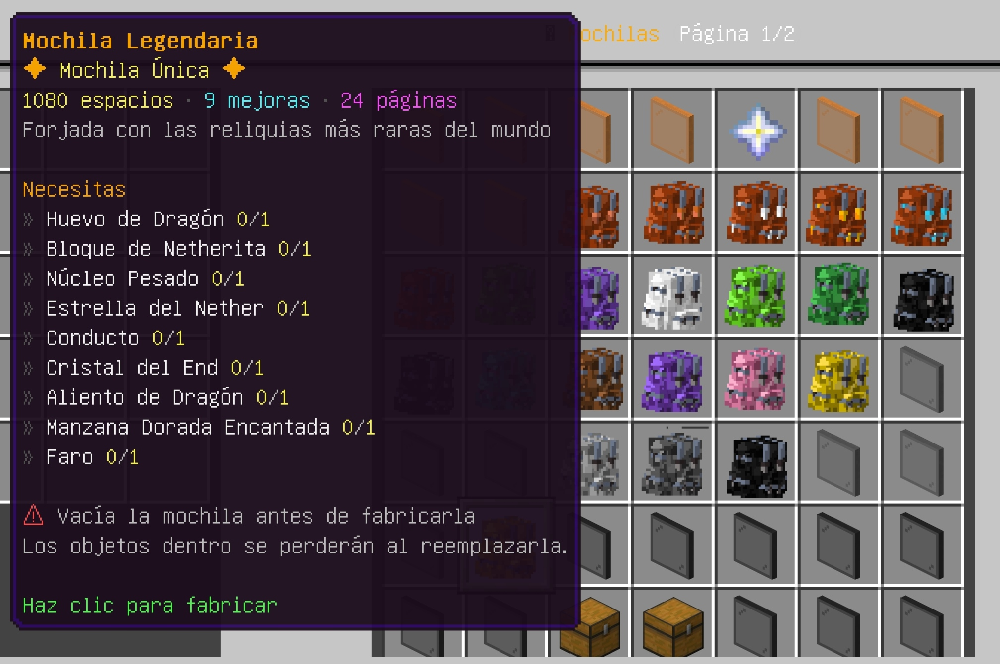
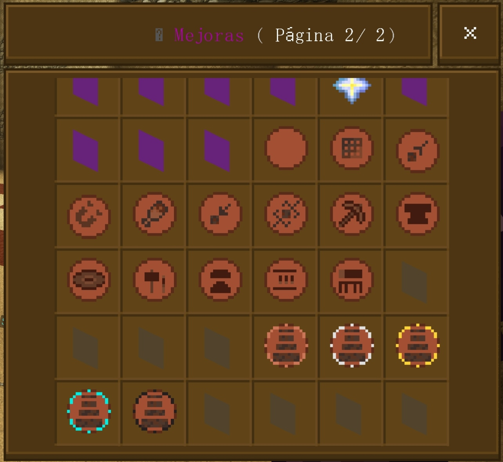

---

# Características

## 21 Niveles + Mochila Legendaria

Esta expansión extiende la progresión por defecto de ProbablyBackpacks a un total de **21 niveles de mochila**, culminando con una **Mochila Legendaria** única que puede fabricarse utilizando algunos de los objetos más raros del juego.

La Mochila Legendaria no forma parte de la progresión normal, sino que representa un objetivo opcional para los jugadores que buscan la solución de almacenamiento definitiva.

La capacidad de las mochilas va desde **27 slots** hasta **765 slots**, permitiendo a los jugadores desbloquear gradualmente más almacenamiento a medida que avanzan.

Cada nuevo nivel se construye sobre la mochila anterior, creando una progresión balanceada y gratificante.

---

## Progresión Balanceada

Cada mochila tiene su propia receta de crafteo diseñada en torno a la progresión de Minecraft.

Los niveles más altos requieren:

- Mochila anterior
- Materiales raros
- Exploración
- Progresión del Nether
- Progresión del End
- Crafteo avanzado

Esto evita que los jugadores salten directamente a las mochilas de end-game.

---

## Integración con DeluxeMenus

Incluye una GUI completa para craftear mochilas.

Características:

- Dos páginas de menú
- Navegación sencilla
- Validación de materiales
- Crafteo automático
- Efectos de sonido
- Mensajes de error
- Navegación entre página anterior/siguiente

Los jugadores nunca necesitan memorizar las recetas de crafteo.

Todo está disponible a través de la interfaz gráfica.

---

## Mejoras de Mochila

El menú también da acceso a las mejoras de ProbablyBackpacks, como:

- Mejora de Crafteo
- Mejora de Recogida
- Mejora Magnética
- Mejora de Alimentación
- Mejora de Restock
- Cambiador de Herramientas
- Compactado
- Horno
- Alto Horno
- Ahumador
- Forja
- Yunque
- Jukebox
- Stack Upgrades

---

# Estructura del Repositorio

```
ProbablyBackpacks-Expansion/

├── ProbablyBackpacks/
│   └── backpacks.yml

└── DeluxeMenus/
    ├── es/                     (GUI en español)
    │   ├── config.yml
    │   └── gui_menus/
    │       ├── probablybackpacks_menu.yml
    │       └── probablybackpacks_menu_page2.yml
    │
    └── en/                     (GUI en inglés)
        ├── config.yml
        └── gui_menus/
            ├── probablybackpacks_menu.yml
            └── probablybackpacks_menu_page2.yml
```

El archivo de recetas `backpacks.yml` es compartido por ambos idiomas — los nombres de los ítems de mochila que define (por ejemplo, `Leather Backpack`) siempre están en inglés sin importar qué idioma de la GUI de DeluxeMenus instales, ya que ProbablyBackpacks los usa internamente.

---

# Compatibilidad

Probado con:

- Paper v26.1.2
- ProbablyBackpacks v2.3
- CuriosPaper v2.0.0
- DeluxeMenus v1.14.1
- PlaceholderAPI v2.12.3
- CheckItem Expansion v2.7.9
- Player Expansion v2.0.9

---

# Requisitos

Antes de instalar este paquete, asegúrate de que tu servidor ya tenga instalados los siguientes plugins:

## Obligatorios

- ProbablyBackpacks
- CuriosPaper
- DeluxeMenus

## Requeridos para la interfaz de DeluxeMenus

Si planeas usar la GUI de DeluxeMenus incluida, también debes instalar:

- PlaceholderAPI
- CheckItem PlaceholderAPI Expansion
- Player PlaceholderAPI Expansion

Sin la expansión CheckItem y Player, la validación de crafteo dentro de la GUI no funcionará correctamente.

Puedes instalarla usando:

```text
/papi ecloud download CheckItem
/papi ecloud download Player
/papi reload
```

---

# Idioma

La interfaz de DeluxeMenus incluida está disponible en **inglés** y **español**, cada una en su propia carpeta (`DeluxeMenus/en/` y `DeluxeMenus/es/`). Instala solo la carpeta correspondiente al idioma de tu servidor — ver [Instalación](#instalación) más abajo.

Ambas versiones son funcionalmente idénticas: mismas recetas, mismos requisitos de materiales, misma lógica de crafteo. Solo cambia el texto de la GUI (títulos, lore, mensajes).

Eres libre de traducir los archivos del menú a cualquier otro idioma editando:

- gui_menus/probablybackpacks_menu.yml
- gui_menus/probablybackpacks_menu_page2.yml

---

# Instalación

## Paso 1

Instala ProbablyBackpacks.

Inicia tu servidor una vez para que el plugin genere su configuración por defecto.

---

## Paso 2

Reemplaza:

```
plugins/ProbablyBackpacks/backpacks.yml
```

con el archivo incluido en este repositorio.

---

## Paso 3

Elige **una** carpeta de idioma — `DeluxeMenus/en/` o `DeluxeMenus/es/` — y copia su contenido dentro de la carpeta de DeluxeMenus de tu servidor.

```
plugins/DeluxeMenus/

config.yml

gui_menus/probablybackpacks_menu.yml

gui_menus/probablybackpacks_menu_page2.yml
```

No mezcles archivos de ambas carpetas de idioma — cada una es un conjunto completo y autocontenido. Reemplaza los archivos existentes si es necesario.

---

## Paso 4

Recarga DeluxeMenus.

```
/dm reload
```

o simplemente reinicia el servidor.

---

# Abrir el Menú

La configuración de DeluxeMenus incluida registra comandos que abren el menú de mochilas. Los alias dependen de qué carpeta de idioma instalaste:

**Inglés (`DeluxeMenus/en/`)**

```
/backpacks

/bps

/bags
```

**Español (`DeluxeMenus/es/`)**

```
/backpacks

/mochilas

/tmochilas

/bps
```

Dependiendo de la configuración de tu servidor, puedes personalizar estos alias.

---

# Sistema de Crafteo

En lugar de usar la mesa de crafteo, los jugadores pueden craftear mochilas directamente desde la GUI.

El menú automáticamente:

- verifica los materiales necesarios
- remueve los ingredientes
- entrega la mochila crafteada
- reproduce sonidos de confirmación
- muestra mensajes de error cuando faltan requisitos

---

# Progresión de Mochilas

La progresión por defecto de ProbablyBackpacks ha sido extendida a un total de **21 niveles de mochila**, cada uno requiriendo la mochila anterior como parte de su receta de crafteo.

Cada nivel de mochila incluye su propia receta de crafteo balanceada, diseñada para coincidir con la progresión del juego.

La progresión completa de mochilas se muestra a continuación:

| Nivel | Mochila    | Slots | Mejoras |
| ----- | ---------- | ----- | ------- |
| 1     | Cuero      | 27    | 1       |
| 2     | Cobre      | 45    | 2       |
| 3     | Hierro     | 54    | 3       |
| 4     | Oro        | 81    | 4       |
| 5     | Diamante   | 108   | 5       |
| 6     | Netherita  | 126   | 6       |
| 7     | Esmeralda  | 144   | 7       |
| 8     | Amatista   | 162   | 7       |
| 9     | Cuarzo     | 180   | 7       |
| 10    | Prismarina | 198   | 8       |
| 11    | Eco        | 216   | 8       |
| 12    | Ender      | 243   | 8       |
| 13    | Dragón     | 270   | 9       |
| 14    | Faro       | 324   | 9       |
| 15    | Ancestral  | 378   | 9       |
| 16    | Maestra    | 432   | 9       |
| 17    | Suprema    | 486   | 9       |
| 18    | Mítica     | 540   | 9       |
| 19    | Divina     | 594   | 9       |
| 20    | Infinita   | 648   | 9       |
| 21    | Definitiva | 765   | 9       |

> **Nota**
> Cada nivel de mochila requiere la mochila anterior como parte de su receta de crafteo, creando una progresión natural desde el almacenamiento de early-game hasta el de end-game.

> **Mochila Legendaria**
> 
> Además de la progresión principal, esta expansión incluye una Mochila Legendaria única con 1080 slots, fabricable mediante una receta especial que requiere algunos de los materiales más raros de Minecraft.

---

# Recetas Personalizadas

Todas las recetas personalizadas de mochilas están definidas en:

```text
backpacks.yml
```

Puedes personalizar cada mochila sin modificar el plugin en sí, incluyendo:

- Ingredientes
- Forma de Crafteo
- Capacidad de la Mochila (Slots)
- Nombre Mostrado
- Lore
- Modelo del Ítem
- Custom Model Data

A continuación se muestran todas las recetas de crafteo incluidas en esta expansión:

<table>
<tr>
<td width="50%" align="center">
<a href="images/es/backpacks-crafting/Mochila_de_cuero.webp">

</a>
</td>
<td width="50%" align="center">
<a href="images/es/backpacks-crafting/Mochila_de_cobre.webp">
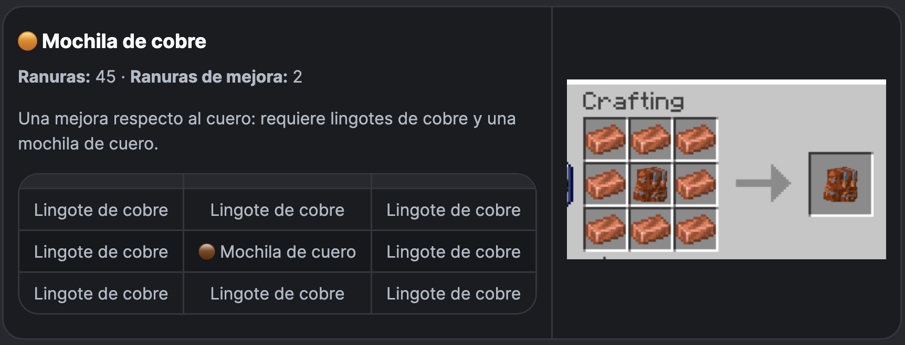
</a>
</td>
</tr>

<tr>
<td width="50%" align="center">
<a href="images/es/backpacks-crafting/Mochila_de_hierro.webp">
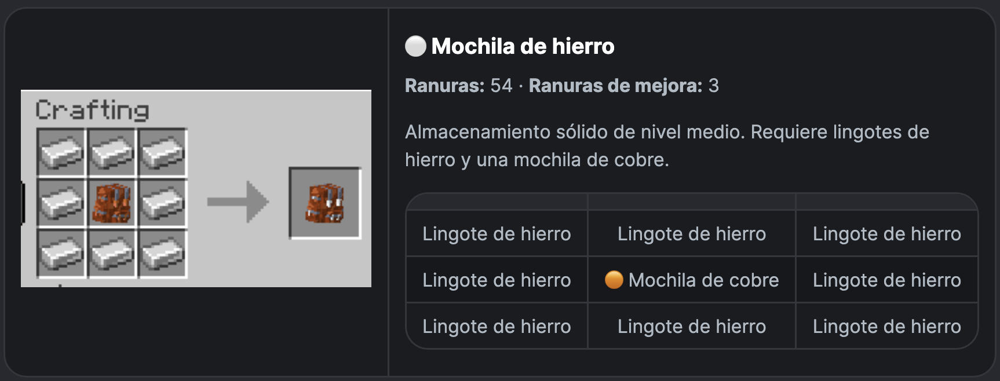
</a>
</td>
<td width="50%" align="center">
<a href="images/es/backpacks-crafting/Mochila_de_oro.webp">

</a>
</td>
</tr>

<tr>
<td width="50%" align="center">
<a href="images/es/backpacks-crafting/Mochila_de_diamante.webp">
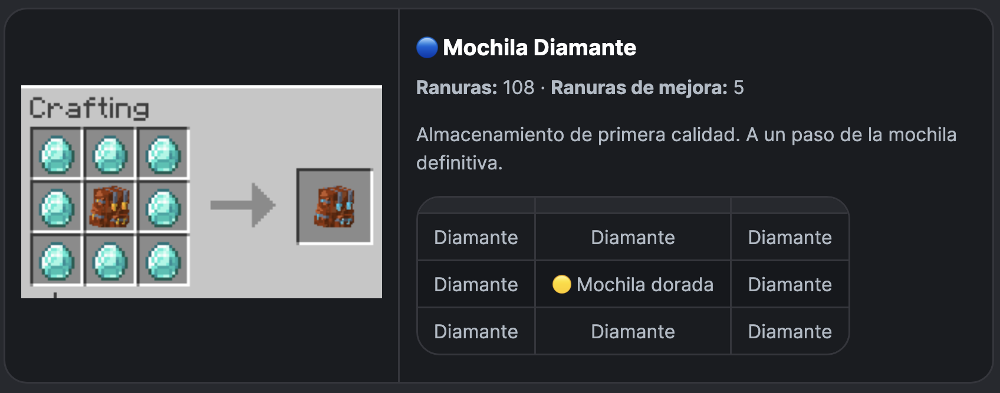
</a>
</td>
<td width="50%" align="center">
<a href="images/es/backpacks-crafting/Mochila_de_netherita.webp">

</a>
</td>
</tr>

<tr>
<td width="50%" align="center">
<a href="images/es/backpacks-crafting/Mochila_de_esmeralda.webp">

</a>
</td>
<td width="50%" align="center">
<a href="images/es/backpacks-crafting/Mochila_de_amatista.webp">

</a>
</td>
</tr>

<tr>
<td width="50%" align="center">
<a href="images/es/backpacks-crafting/Mochila_de_cuarzo.webp">

</a>
</td>
<td width="50%" align="center">
<a href="images/es/backpacks-crafting/Mochila_de_prismarina.webp">

</a>
</td>
</tr>

<tr>
<td width="50%" align="center">
<a href="images/es/backpacks-crafting/Mochila_echo.webp">
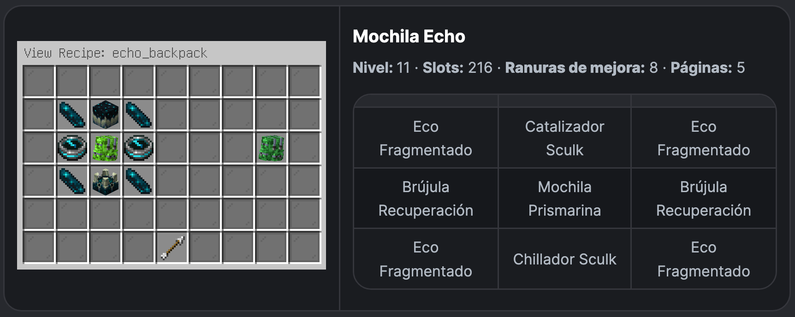
</a>
</td>
<td width="50%" align="center">
<a href="images/es/backpacks-crafting/Mochila_ender.webp">

</a>
</td>
</tr>

<tr>
<td width="50%" align="center">
<a href="images/es/backpacks-crafting/Mochila_dragon.webp">

</a>
</td>
<td width="50%" align="center">
<a href="images/es/backpacks-crafting/Mochila_faro.webp">

</a>
</td>
</tr>

<tr>
<td width="50%" align="center">
<a href="images/es/backpacks-crafting/Mochila_ancestral.webp">
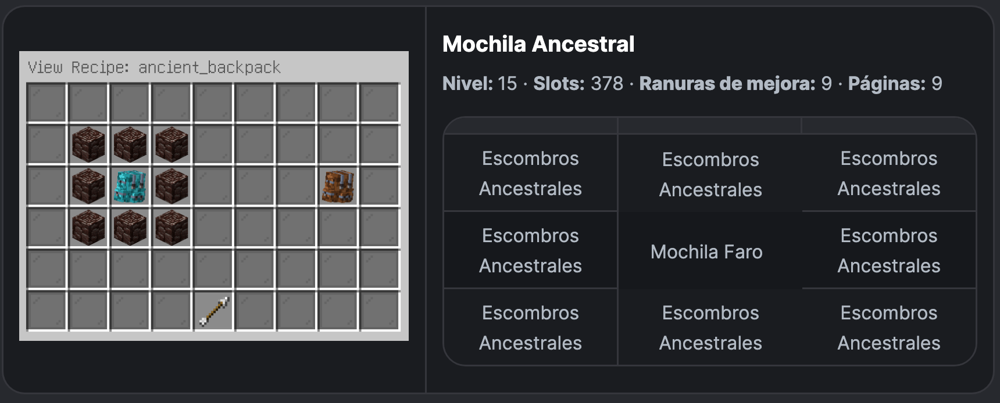
</a>
</td>
<td width="50%" align="center">
<a href="images/es/backpacks-crafting/Mochila_maestra.webp">

</a>
</td>
</tr>

<tr>
<td width="50%" align="center">
<a href="images/es/backpacks-crafting/Mochila_suprema.webp">

</a>
</td>
<td width="50%" align="center">
<a href="images/es/backpacks-crafting/Mochila_mitica.webp">

</a>
</td>
</tr>

<tr>
<td width="50%" align="center">
<a href="images/es/backpacks-crafting/Mochila_divina.webp">
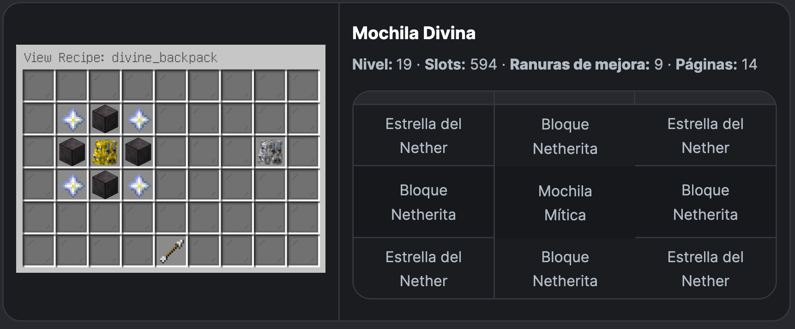
</a>
</td>
<td width="50%" align="center">
<a href="images/es/backpacks-crafting/Mochila_infinita.webp">

</a>
</td>
</tr>

<tr>
<td width="50%" align="center">
<a href="images/es/backpacks-crafting/Mochila_definitiva.webp">
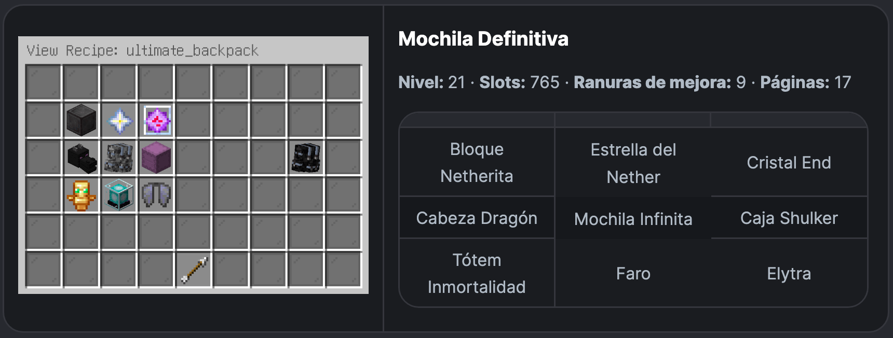
</a>
</td>
<td width="50%" align="center">
<a href="images/es/backpacks-crafting/Mochila_legendaria.webp">
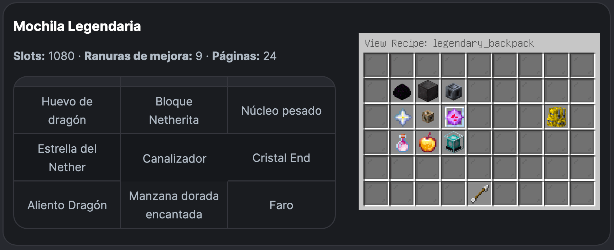
</a>
</td>
</tr>

</table>

> 💡 **Tip:** Haz clic en cualquier imagen para verla en resolución completa.

---

# DeluxeMenus

La GUI incluida está disponible en inglés y español, y ofrece una interfaz intuitiva para que los jugadores craftean mochilas y mejoras sin memorizar recetas.

- Crafteo de mochilas
- Mejoras de mochila
- Stack upgrades
- Navegación entre páginas

Los menús también validan el inventario del jugador antes de permitir cualquier crafteo.

---

# Personalización

Puedes modificar de forma segura:

- recetas
- nombres mostrados
- lore
- comandos
- sonidos
- permisos
- íconos
- diseño del menú

para adaptarlos a tu servidor.

---

# Notas

No elimines los IDs de mochila existentes.

Cambiar los IDs puede romper las mochilas de los jugadores existentes.

Siempre mantén una copia de seguridad antes de modificar las recetas.

Después de cambiar la configuración de DeluxeMenus recuerda ejecutar:

```
/dm reload
```

o reiniciar el servidor.

---

# Créditos

## Plugin Original

- ProbablyBackpacks por **Brothergaming52**

## Dependencias

- CuriosPaper
- DeluxeMenus
- PlaceholderAPI
- CheckItem & Player Expansion

## Paquete de Expansión

Creado y mantenido por **Angel Ramirez**.

Las contribuciones, sugerencias y mejoras en GitHub siempre son bienvenidas.
