# ProbablyBackpacks Expansion

**English** | [Español](README.es.md)

A configuration pack for **ProbablyBackpacks** that extends the default backpack progression to **21 backpack tiers + a unique Legendary Backpack**, featuring balanced crafting recipes and a fully integrated **DeluxeMenus** interface.

> **Note**
> This repository is **not** a plugin or a fork of ProbablyBackpacks. It is a community-made configuration pack that extends the original plugin.

---

## DeluxeMenus Interface
Craft backpacks & upgrades directly from the GUI.

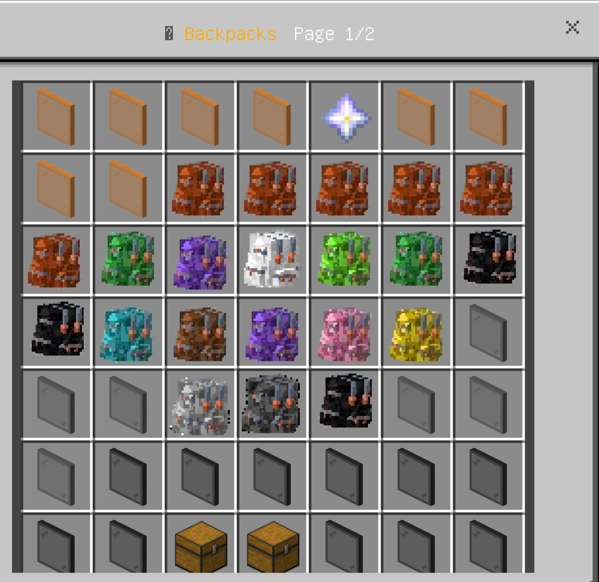
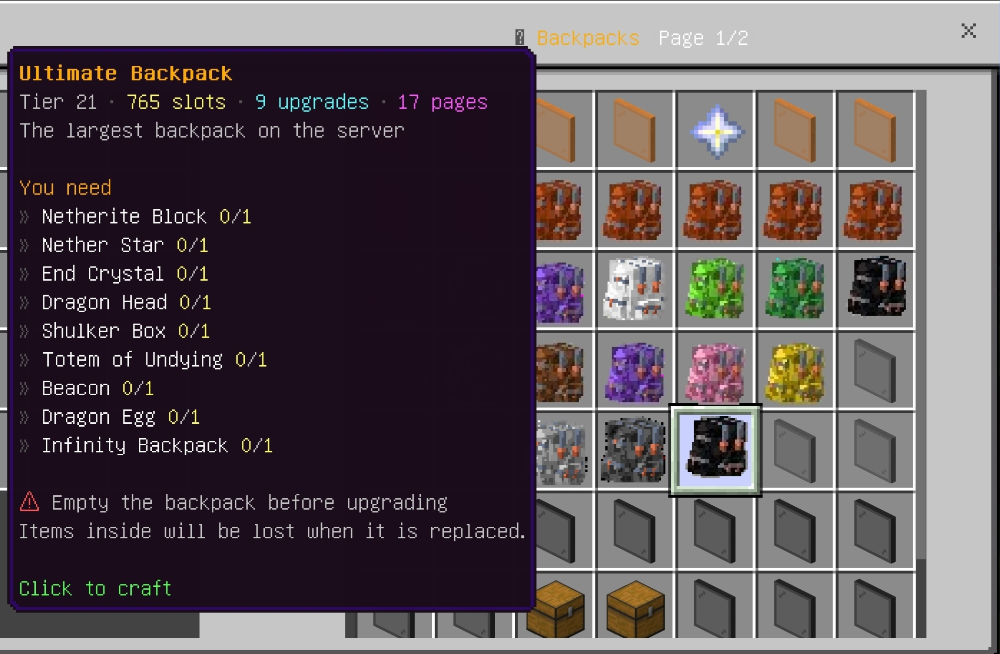
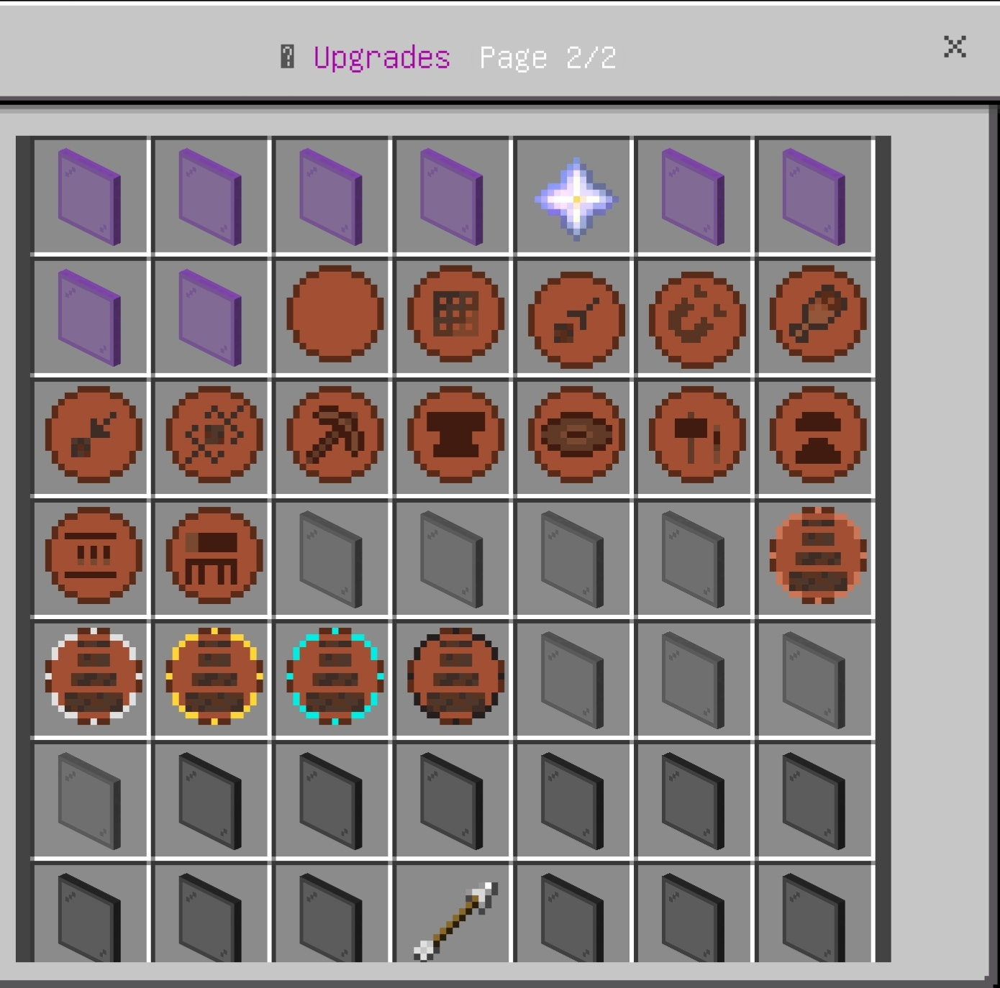

---

# Features

## 21 Backpack Tiers + Legendary Backpack

This expansion extends ProbablyBackpacks' default progression to a total of **21 backpack tiers**, culminating in a unique **Legendary Backpack** that can be crafted using some of the rarest items in the game.

The Legendary Backpack is not part of the normal progression. Instead, it serves as an optional end-game goal for players seeking the ultimate storage solution.

Backpack capacities range from **27 slots** up to **765 slots**, allowing players to gradually unlock larger storage as they progress.

Each new tier builds upon the previous backpack, creating a balanced and rewarding progression.

---

## Balanced Progression

Every backpack has its own crafting recipe designed around Minecraft progression.

Higher tiers require:

- Previous backpack
- Rare materials
- Exploration
- Nether progression
- End progression
- Advanced crafting

This prevents players from skipping directly to end-game backpacks.

---

## DeluxeMenus Integration

Includes a complete GUI for backpack crafting.

Features:

- Two menu pages
- Easy navigation
- Material validation
- Automatic crafting
- Sound effects
- Error messages
- Previous/Next page navigation

Players never need to remember crafting recipes.

Everything is available through the graphical interface.

---

## Backpack Upgrades

The menu also provides access to ProbablyBackpacks upgrades such as:

- Crafting Upgrade
- Pickup Upgrade
- Magnet Upgrade
- Feeding Upgrade
- Refill Upgrade
- Tool Swapper
- Compacting
- Furnace
- Blast Furnace
- Smoker
- Smithing
- Anvil
- Jukebox
- Stack Upgrades

---

# Repository Structure

```
ProbablyBackpacks-Expansion/

├── ProbablyBackpacks/
│   └── backpacks.yml

└── DeluxeMenus/
    ├── es/                     (Spanish GUI)
    │   ├── config.yml
    │   └── gui_menus/
    │       ├── probablybackpacks_menu.yml
    │       └── probablybackpacks_menu_page2.yml
    │
    └── en/                     (English GUI)
        ├── config.yml
        └── gui_menus/
            ├── probablybackpacks_menu.yml
            └── probablybackpacks_menu_page2.yml
```

The `backpacks.yml` recipe file is shared by both languages — the backpack item names it defines (e.g. `Leather Backpack`) are always in English regardless of which DeluxeMenus GUI language you install, since ProbablyBackpacks uses them internally.

---

# Compatibility

Tested with:

- Paper v26.1.2
- ProbablyBackpacks v2.3
- CuriosPaper v2.0.0
- DeluxeMenus v1.14.1
- PlaceholderAPI v2.12.3
- CheckItem Expansion v2.7.9
- Player Expansion v2.0.9

---

# Requirements

Before installing this pack, make sure your server already has the following plugins installed:

## Required

- ProbablyBackpacks
- CuriosPaper
- DeluxeMenus

## Required for the DeluxeMenus interface

If you plan to use the included DeluxeMenus GUI, you must also install:

- PlaceholderAPI
- CheckItem PlaceholderAPI Expansion
- Player PlaceholderAPI Expansion

Without the CheckItem & Player expansion, the crafting validation inside the GUI will not work correctly.

You can install it using:

```text
/papi ecloud download CheckItem
/papi ecloud download Player
/papi reload
```

---

# Language

The included DeluxeMenus interface is available in **English** and **Spanish**, each in its own folder (`DeluxeMenus/en/` and `DeluxeMenus/es/`). Install only the folder matching your server's language — see [Installation](#installation) below.

The two versions are functionally identical: same recipes, same item requirements, same crafting logic. Only the GUI text (titles, lore, messages) differs.

You are free to translate the menu files into any other language by editing:

- gui_menus/probablybackpacks_menu.yml
- gui_menus/probablybackpacks_menu_page2.yml

---

# Installation

## Step 1

Install ProbablyBackpacks.

Start your server once so the plugin generates its default configuration.

---

## Step 2

Replace:

```
plugins/ProbablyBackpacks/backpacks.yml
```

with the file included in this repository.

---

## Step 3

Choose **one** language folder — `DeluxeMenus/en/` or `DeluxeMenus/es/` — and copy its contents into your server's DeluxeMenus folder.

```
plugins/DeluxeMenus/

config.yml

gui_menus/probablybackpacks_menu.yml

gui_menus/probablybackpacks_menu_page2.yml
```

Do not mix files from both language folders — each one is a complete, self-contained set. Replace existing files if necessary.

---

## Step 4

Reload DeluxeMenus.

```
/dm reload
```

or simply restart the server.

---

# Opening the Menu

The included DeluxeMenus configuration registers commands that open the backpack menu. The aliases depend on which language folder you installed:

**English (`DeluxeMenus/en/`)**

```
/backpacks

/bps

/bags
```

**Spanish (`DeluxeMenus/es/`)**

```
/backpacks

/mochilas

/tmochilas

/bps
```

Depending on your server configuration you may customize these aliases.

---

# Crafting System

Instead of using the crafting table, players can craft backpacks directly from the GUI.

The menu automatically:

- checks required materials
- removes ingredients
- gives the crafted backpack
- plays confirmation sounds
- displays failure messages when requirements are missing

---

# Backpack Progression

The default ProbablyBackpacks progression has been extended to a total of **21 backpack tiers**, each requiring the previous backpack as part of its crafting recipe.

Each backpack tier includes its own balanced crafting recipe designed to match the progression of the game.

The complete backpack progression is shown below:

| Tier | Backpack   | Slots | Upgrades |
| ---- | ---------- | ----- | -------- |
| 1    | Leather    | 27    | 1        |
| 2    | Copper     | 45    | 2        |
| 3    | Iron       | 54    | 3        |
| 4    | Gold       | 81    | 4        |
| 5    | Diamond    | 108   | 5        |
| 6    | Netherite  | 126   | 6        |
| 7    | Emerald    | 144   | 7        |
| 8    | Amethyst   | 162   | 7        |
| 9    | Quartz     | 180   | 7        |
| 10   | Prismarine | 198   | 8        |
| 11   | Echo       | 216   | 8        |
| 12   | Ender      | 243   | 8        |
| 13   | Dragon     | 270   | 9        |
| 14   | Beacon     | 324   | 9        |
| 15   | Ancient    | 378   | 9        |
| 16   | Master     | 432   | 9        |
| 17   | Supreme    | 486   | 9        |
| 18   | Mythic     | 540   | 9        |
| 19   | Divine     | 594   | 9        |
| 20   | Infinite   | 648   | 9        |
| 21   | Ultimate   | 765   | 9        |

> **Note**
> Each backpack tier requires the previous backpack as part of its crafting recipe, creating a natural progression from early-game to end-game storage.

> **Legendary Backpack**
>
> In addition to the main progression, this expansion includes a unique **Legendary Backpack** with **1080 slots**, craftable through a special recipe that requires some of Minecraft's rarest materials.

---

# Custom Recipes

All custom backpack recipes are defined in:

```text
backpacks.yml
```

You can customize every backpack without modifying the plugin itself, including:

- Ingredients
- Crafting Shape
- Backpack Capacity (Slots)
- Display Name
- Lore
- Item Model
- Custom Model Data

Below are all crafting recipes included in this expansion:

<table>
<tr>
<td width="50%" align="center">
<a href="images/en/backpacks-crafting/Backpack_leather.png">
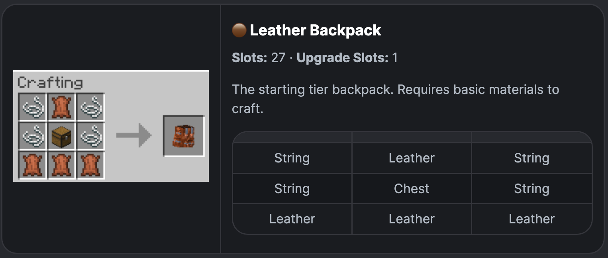
</a>
</td>
<td width="50%" align="center">
<a href="images/en/backpacks-crafting/Backpack_copper.png">
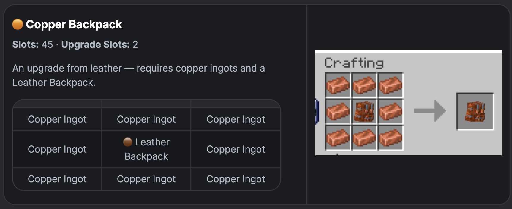
</a>
</td>
</tr>

<tr>
<td width="50%" align="center">
<a href="images/en/backpacks-crafting/Backpack_iron.png">
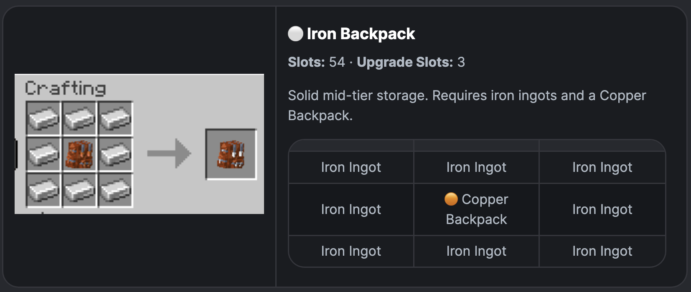
</a>
</td>
<td width="50%" align="center">
<a href="images/en/backpacks-crafting/Backpack_gold.png">
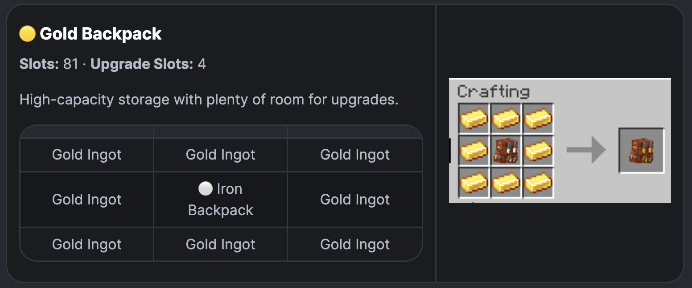
</a>
</td>
</tr>

<tr>
<td width="50%" align="center">
<a href="images/en/backpacks-crafting/Backpack_diamond.png">
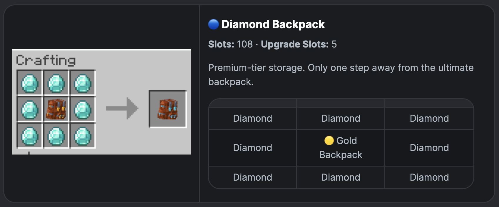
</a>
</td>
<td width="50%" align="center">
<a href="images/en/backpacks-crafting/Backpack_netherite.png">
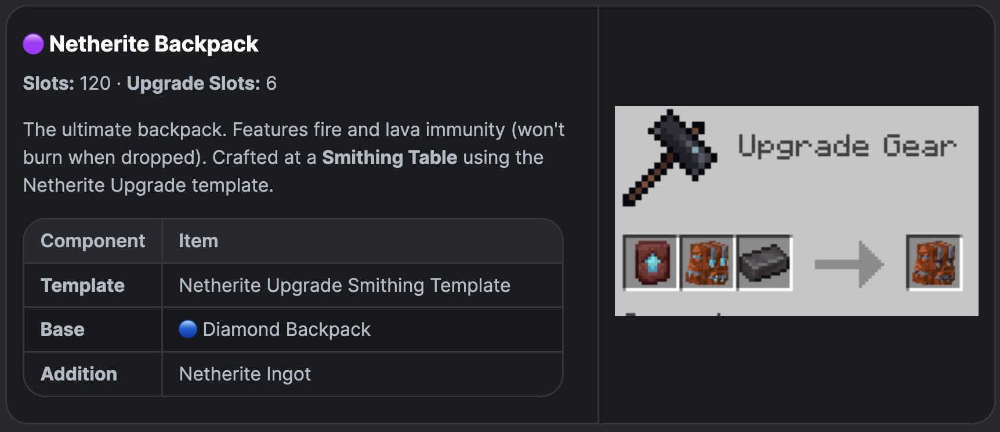
</a>
</td>
</tr>

<tr>
<td width="50%" align="center">
<a href="images/en/backpacks-crafting/Backpack_emerald.png">
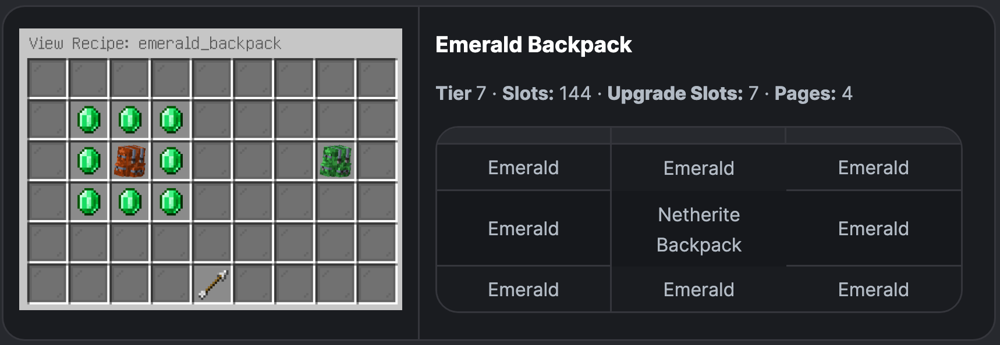
</a>
</td>
<td width="50%" align="center">
<a href="images/en/backpacks-crafting/Backpack_amethyst.png">
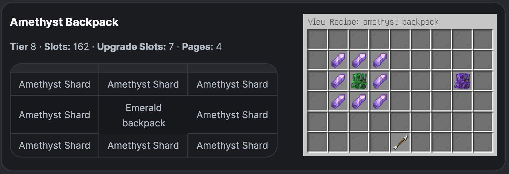
</a>
</td>
</tr>

<tr>
<td width="50%" align="center">
<a href="images/en/backpacks-crafting/Backpack_quartz.png">
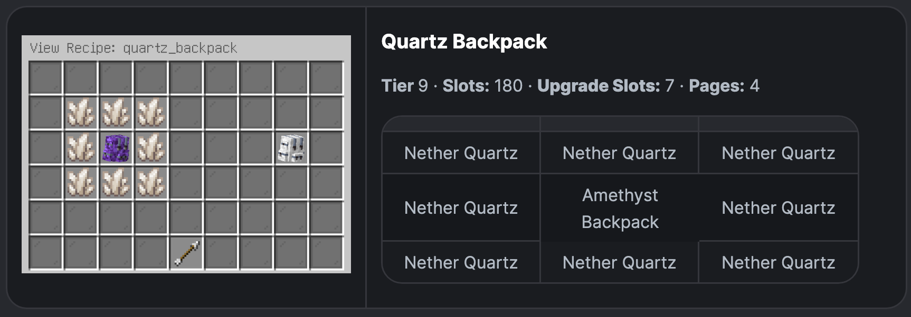
</a>
</td>
<td width="50%" align="center">
<a href="images/en/backpacks-crafting/Backpack_prismarine.png">
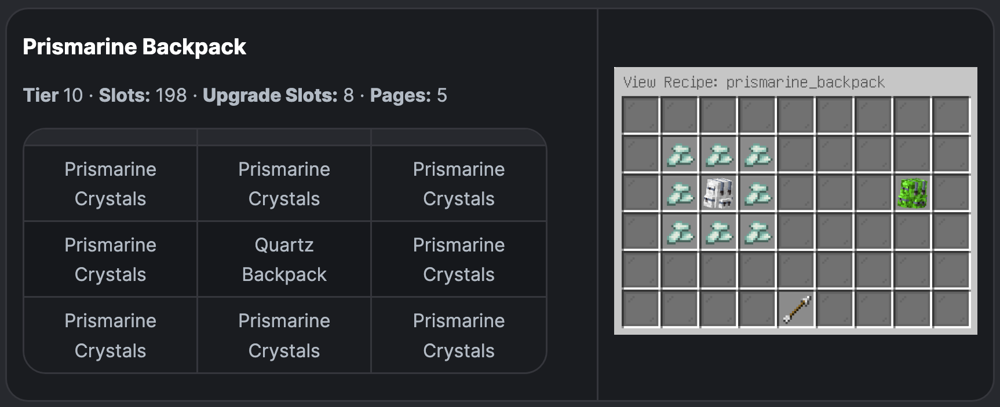
</a>
</td>
</tr>

<tr>
<td width="50%" align="center">
<a href="images/en/backpacks-crafting/Backpack_echo.png">
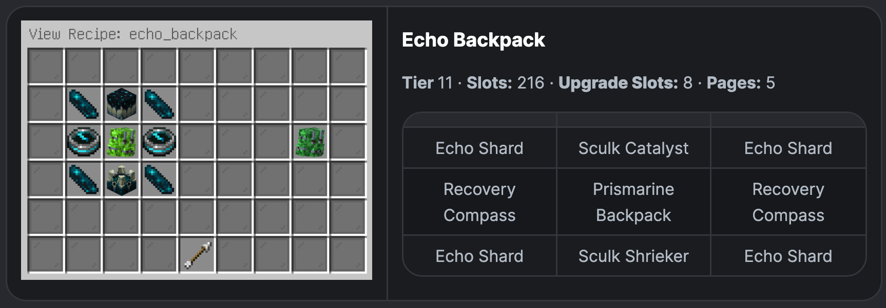
</a>
</td>
<td width="50%" align="center">
<a href="images/en/backpacks-crafting/Backpack_ender.png">
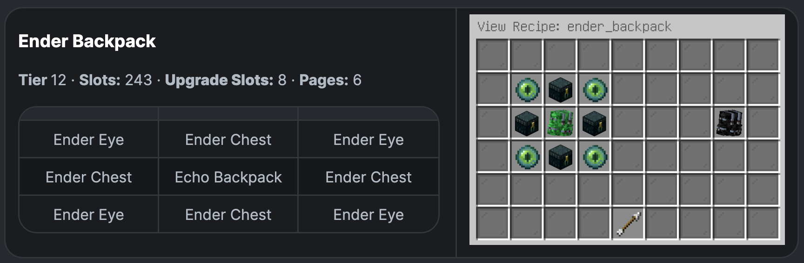
</a>
</td>
</tr>

<tr>
<td width="50%" align="center">
<a href="images/en/backpacks-crafting/Backpack_dragon.png">
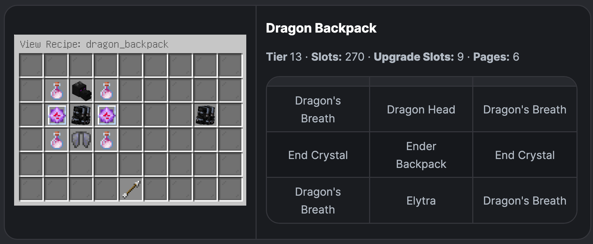
</a>
</td>
<td width="50%" align="center">
<a href="images/en/backpacks-crafting/Backpack_beacon.png">
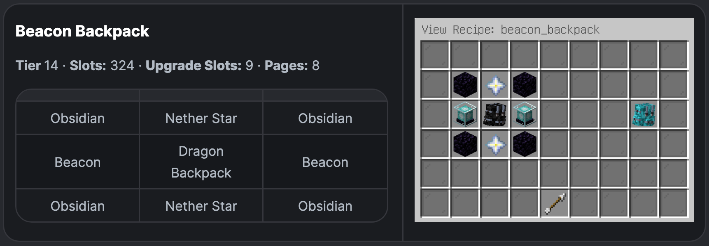
</a>
</td>
</tr>

<tr>
<td width="50%" align="center">
<a href="images/en/backpacks-crafting/Backpack_ancient.png">
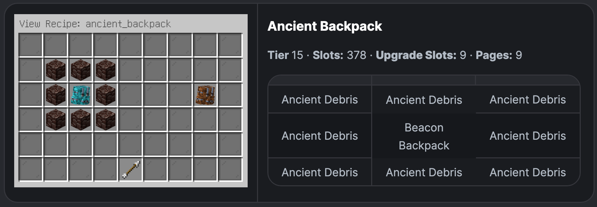
</a>
</td>
<td width="50%" align="center">
<a href="images/en/backpacks-crafting/Backpack_master.png">
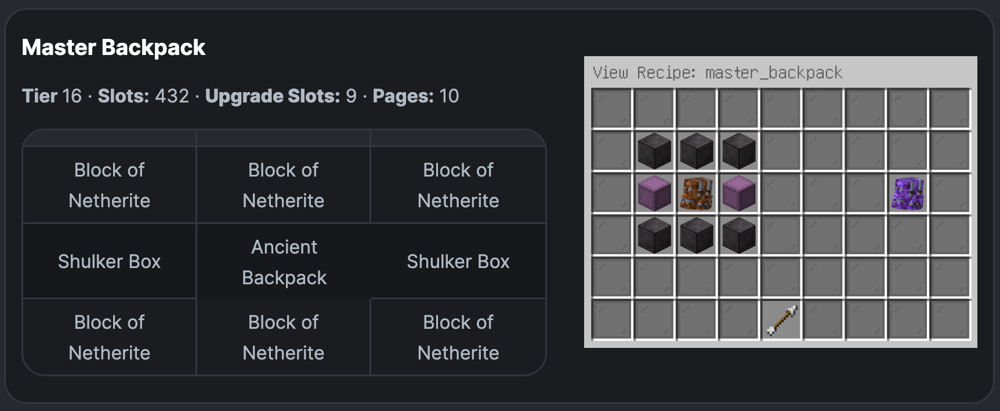
</a>
</td>
</tr>

<tr>
<td width="50%" align="center">
<a href="images/en/backpacks-crafting/Backpack_supreme.png">
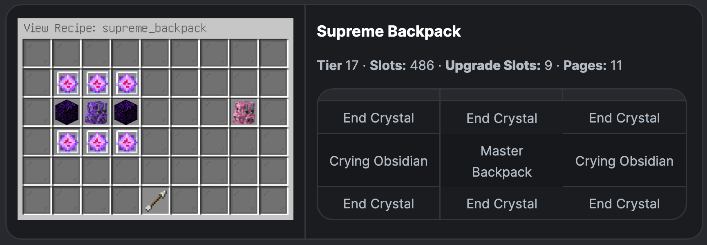
</a>
</td>
<td width="50%" align="center">
<a href="images/en/backpacks-crafting/Backpack_mythic.png">
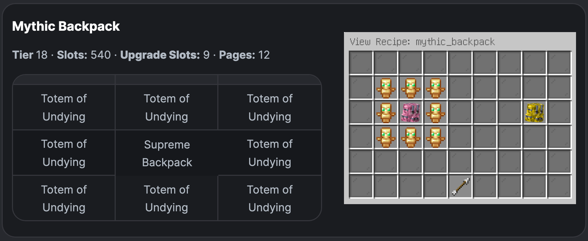
</a>
</td>
</tr>

<tr>
<td width="50%" align="center">
<a href="images/en/backpacks-crafting/Backpack_divine.png">
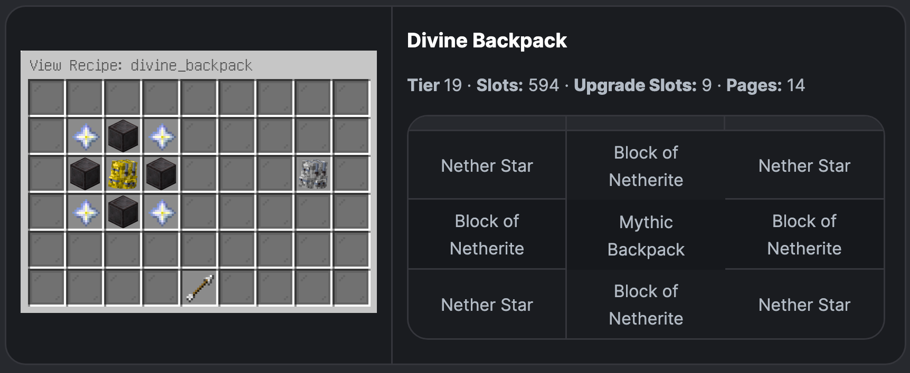
</a>
</td>
<td width="50%" align="center">
<a href="images/en/backpacks-crafting/Backpack_infinite.png">
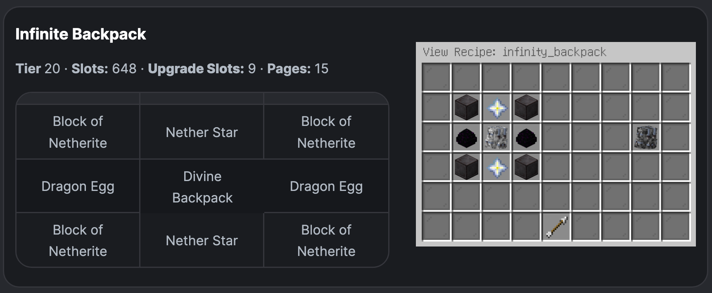
</a>
</td>
</tr>

<tr>
<td width="50%" align="center">
<a href="images/en/backpacks-crafting/Backpack_ultimate.png">
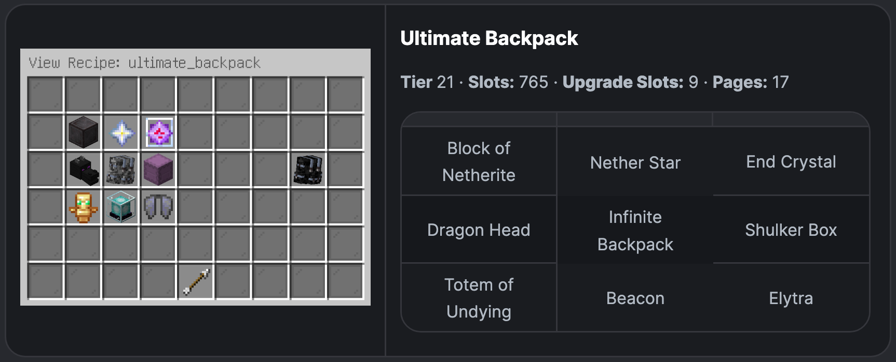
</a>
</td>
<td width="50%" align="center">
<a href="images/en/backpacks-crafting/Backpack_legendary.png">
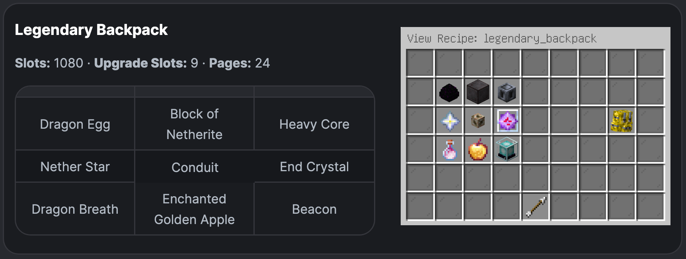
</a>
</td>
</tr>

</table>

> 💡 **Tip:** Click any image to view it in full resolution.

---

# DeluxeMenus

The included GUI is available in English and Spanish and provides an intuitive interface so players can craft backpacks and upgrades without memorizing recipes.

- Backpack crafting
- Backpack upgrades
- Stack upgrades
- Navigation between pages

The menus also validate the player's inventory before allowing any craft.

---

# Customization

You may safely modify:

- recipes
- display names
- lore
- commands
- sounds
- permissions
- icons
- menu layout

to match your server.

---

# Notes

Do not delete existing backpack IDs.

Changing IDs may break existing player backpacks.

Always keep a backup before modifying recipes.

After changing DeluxeMenus configuration remember to run:

```
/dm reload
```

or restart the server.

---

# Credits

## Original Plugin

- ProbablyBackpacks by **Brothergaming52**

## Dependencies

- CuriosPaper
- DeluxeMenus
- PlaceholderAPI
- CheckItem & Player Expansion

## Expansion Pack

Created and maintained by **Angel Ramirez**.

GitHub contributions, suggestions and improvements are always welcome.